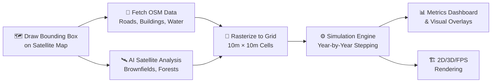
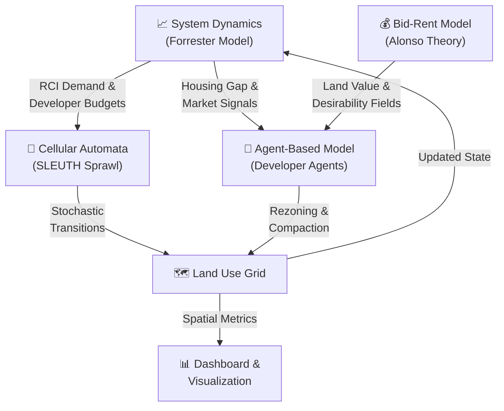
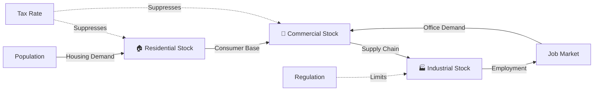
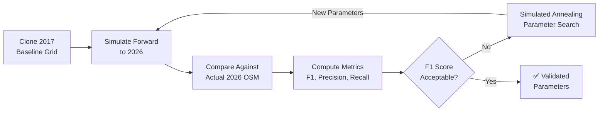
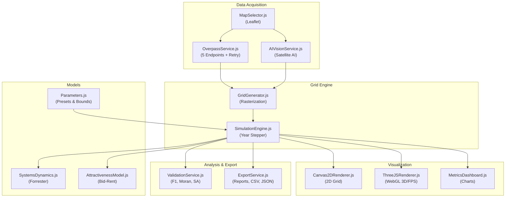

# 🏙️ RealCity3000

### Interactive Urban Growth Digital Twin & Spatial Simulation Platform

> **From satellite imagery to simulated futures** — draw a bounding box anywhere on Earth, fuse real OpenStreetMap data with AI-classified satellite tiles, and watch a scientifically grounded urban simulation unfold across decades of simulated time.

[](https://realcity3000.vercel.app)
[](LICENSE)
[](#-technology-stack)

*Developed by the Union Nikola Tesla University Academic Staff Team, Belgrade*

---

## 📖 What Is RealCity3000?

Cities are complex adaptive systems. When a new transit corridor opens, a zoning policy changes, or industrial jobs leave, the ripple effects cascade through housing markets, traffic patterns, and land values over years and decades. Predicting these cascades is one of urban planning's hardest challenges.

**RealCity3000** is a browser-based digital twin platform that lets anyone — urban planners, researchers, students, or curious minds — simulate these dynamics using real geographic data:

1. 🗺️ **Select any area on Earth** using a satellite map
2. 🏗️ **Extract real buildings, roads, and water bodies** from OpenStreetMap
3. 🛰️ **Classify terrain** using AI satellite image analysis (forests, brownfields, vacant lots)
4. ⚙️ **Simulate decades of growth** using peer-reviewed urban science models
5. 📊 **Analyze results** with spatial metrics, Monte Carlo forecasts, and validation tools

> **The key insight**: RealCity3000 doesn't just simulate *a* city — it simulates *your chosen city* using its actual geography as the starting condition.

---

## 🔄 How It Works: The Pipeline

The simulation pipeline transforms raw geographic data into a living, evolving urban system:



### Step 1: Geographic Data Acquisition

You draw a bounding box on the satellite map. RealCity3000 simultaneously:
- Queries **5 redundant Overpass API endpoints** for OpenStreetMap vector data (buildings, highways, waterways, land use polygons)
- Fetches an **ESRI satellite tile** and sends it to an AI vision model for terrain classification
- Runs a **performance benchmark** to auto-calibrate grid resolution to your hardware

### Step 2: Dual-Source Spatial Fusion

The raw data is fused into a unified land-use grid:
- **Bresenham's Line Algorithm** rasterizes road networks into cell connectivity paths
- **Point-in-Polygon** tests project building footprints onto grid cells
- **AI-classified overlays** seed forests, brownfields, and vacant lots from satellite imagery
- Each cell stores 12+ attributes: type, density, elevation, road access, land value, pollution, population, etc.

### Step 3: Simulation Execution

Every "step" represents one simulated year. Four interconnected models run in sequence:



---

## 🎨 Visual Showcase

### 🗺️ Map Selection & Data Extraction
Select any region on Earth. The satellite map lets you draw a bounding box, configure grid resolution, and optionally provide AI API keys for enhanced terrain classification.


### 📐 2D Grid Simulation View
The core simulation view renders each grid cell by its land-use classification. Watch buildings appear, roads attract development, and commercial centers emerge organically as the simulation progresses year by year.


### 🔮 Urban Growth Over Time
Compare early-stage development (sparse residential clusters) with late-stage patterns (dense polycentric growth with commercial corridors):

| Early Development (Year ~2670) | Dense Urban Fabric (Year ~2072) |
|:---:|:---:|
|  |  |

### 🎮 First-Person Street Explorer (FPS Mode)
Walk through your simulated city at ground level. Commercial towers glow cyan, residential blocks in warm amber, industrial facilities in deep purple. Trees dot the parks and boulevards.


---

## 🧮 Mathematical Framework

RealCity3000 implements four interconnected scientific models. Each is grounded in published urban science literature.

### A. Forrester System Dynamics (Macro-Economic Engine)

The city's economy is modeled as a **stocks-and-flows** feedback system inspired by Jay Forrester's *Urban Dynamics* (1969). Three coupled stocks — Residential (R), Commercial (C), and Industrial (I) — interact through demand multipliers:



**Demand is computed as:**

$$F_{demand}(t) = \text{clamp}\left(\frac{R_{demand} + C_{demand} + I_{demand}}{3}, 0.1, 2.0\right)$$

Where housing demand is driven by the gap between population and available housing:

$$R_{demand} = \text{BaseDemand} \times \left(1 + \frac{\text{HousingGap}}{1000}\right) \times (1 - 0.005 \times \text{TaxRate})$$

### B. Alonso Bid-Rent Model (Land Value Fields)

Land values follow William Alonso's **Bid-Rent Theory** (1964): property value decays exponentially with distance from commercial centers, creating realistic polycentric value peaks:

$$V(x,y) = V_{\text{base}} \times \text{Access}^{0.6} \times \text{GreenProx}^{0.3} \times (1 - \text{Pollution}^{0.6}) \times e^{-\lambda \cdot d_{com}}$$

Where:
| Symbol | Meaning | Value |
|:---|:---|:---|
| $\lambda$ | Spatial decay constant | 0.015 |
| $d_{com}$ | Euclidean distance to nearest Commercial cell | Grid units |
| Access | Road connectivity score | [0, 1] |
| GreenProx | Proximity to parks/forests | [0, 1] |
| Pollution | Industrial smoke dispersal (inverse-square) | [0, 1] |

### C. SLEUTH Cellular Automata (Sprawl Mechanics)

Urban growth is modeled using four **Monte Carlo CA transition rules**, inspired by the SLEUTH model (Clarke, Hoppen & Gaydos, 1997). All transitions are constrained by local carrying capacity $(1 - D_{urban})$ and economic demand $F_{demand}$:

| Rule | Equation | What It Models |
|:---|:---|:---|
| **Spontaneous** | $P = \frac{\text{Diffusion}}{2500} \times (1 - \frac{\text{Slope}}{10}) \times (1 - D_{urban}) \times F_{demand}$ | Random nucleation of new urban cells |
| **Breed** | $P = \frac{\text{Breed}}{150} \times (1 - D_{urban}) \times F_{demand}$ | Newly-born cells becoming permanent growth nuclei |
| **Edge Growth** | $P = \frac{\text{Spread}}{200} \times N_{urban} \times (1 - D_{urban}) \times F_{demand}$ | Organic agglomeration from urban edges |
| **Road Gravity** | $P = \frac{\text{RoadGrav}}{200} \times e^{-d_{road}/10} \times (1 - D_{urban}) \times F_{demand}$ | Development attracted to transport corridors |

> $N_{urban}$ = count of developed Moore neighbors (0–8), $d_{road}$ = distance to nearest road

### D. Agent-Based Developer Model (Micro-Economic Decisions)

Autonomous developer agents scan the grid and build on cells that maximize their **discrete utility function**:

| Agent Class | Utility $U$ |
|:---|:---|
| 🏠 Residential | $U_R = 0.4 \cdot \text{Access} + 0.3 \cdot \text{Green} - 0.2 \cdot \text{Pollution} - 0.1 \cdot V_{land}$ |
| 🏢 Commercial | $U_C = 0.4 \cdot \text{LocalPop} + 0.4 \cdot \text{Access} + 0.2 \cdot V_{land}$ |
| 🏭 Industrial | $U_I = 0.5 \cdot (1 - V_{land}) + 0.4 \cdot \text{Access} - 0.3 \cdot \text{LocalPop}$ |

Each agent type has different preferences: residential developers avoid pollution and seek green space, commercial developers want foot traffic and accessibility, industrial developers seek cheap land away from residents.

---

## 🔬 Validation & Calibration

How do we know the simulation produces realistic results? RealCity3000 includes a built-in scientific validation pipeline:



### Historical Validation
The engine clones your loaded map, clears development back to a **2017 baseline**, simulates forward to **2026**, and computes spatial matching metrics against the actual 2026 OSM reality.

### Simulated Annealing Auto-Calibration
Click **Calibrate** to run a Boltzmann cooling optimization loop that automatically searches for the parameter combination (Diffusion, Spread, Road Gravity) that maximizes F1-Score alignment with reality:

$$T_k = T_0 \times \alpha^k \quad \text{where } T_0 = 0.5, \; \alpha = 0.85$$

$$P(\text{Accept}) = \begin{cases} 1 & \text{if } C(\theta') < C(\theta) \\ e^{-\frac{C(\theta') - C(\theta)}{T_k}} & \text{otherwise} \end{cases}$$

### Spatial Science Metrics

| Metric | Formula | Interpretation |
|:---|:---|:---|
| **Shannon Entropy** | $H = -\frac{\sum_{k=1}^{64} p_k \ln(p_k)}{\ln(64)}$ | Low = compact city, High = dispersed sprawl |
| **Moran's I** | $I = \frac{N}{S_0} \frac{\sum_i \sum_j w_{ij}(x_i - \bar{x})(x_j - \bar{x})}{\sum_i (x_i - \bar{x})^2}$ | Spatial autocorrelation of land values |
| **Growth Dispersion** | $GDI = \frac{\text{Spontaneous cells}}{\text{Edge growth cells}}$ | Ratio of random vs. organic growth |

---

## 📊 Monte Carlo Forecasting & Sensitivity Analysis

### Monte Carlo Ensemble
RealCity3000 runs **N parallel simulations** with ±15% parameter perturbation to produce statistical confidence bounds on all key metrics (population, density, land value, pollution):

$$\text{For each run } i: \; \theta_i = \theta_{\text{base}} \times (1 + \mathcal{U}(-0.15, 0.15))$$

Results include mean, median, standard deviation, and 5th/95th percentile confidence intervals.

### One-at-a-Time (OAT) Sensitivity
Each of the 11 simulation parameters is individually perturbed ±20% while holding all others constant. The output measures which parameters have the largest impact on urban density — critical for understanding model behavior and parameter importance.

---

## 🧩 Visual Layer Force Fields

Toggle between four overlay heatmaps to inspect the simulation's internal "force fields" — the hidden variables that drive growth decisions:

| Layer | Color Scale | What It Shows |
|:---|:---|:---|
| **Accessibility** | Transparent → Cyan | Road connectivity score per cell |
| **Land Value** | Transparent → Gold | Bid-Rent derived property value |
| **Pollution** | Transparent → Purple | Industrial emission dispersal footprint |
| **Growth Pressure** | Transparent → Red | Current development demand intensity |

Each legend dynamically updates to reflect the active overlay, showing continuous gradient scales with labeled endpoints.

---

## 🛠️ Technology Stack

RealCity3000 runs 100% in the browser with zero server-side computation:

| Component | Technology | Purpose |
|:---|:---|:---|
| 3D Rendering | **Three.js** (`InstancedMesh`) | 60 FPS GPU-instanced building rendering |
| Map Selection | **Leaflet.js** | Interactive satellite map with bbox drawing |
| Build Tool | **Vite** | Ultra-fast HMR development & production builds |
| AI Vision | **OpenRouter / OpenAI** | Optional satellite terrain classification |
| AI Mayor | **LLM API** | Optional AI-driven policy advisor |
| Data Source | **OpenStreetMap Overpass API** | Real-world building/road/water vector data |
| Satellite Tiles | **ESRI World Imagery** | High-resolution satellite base maps |
| Hosting | **Vercel** | Edge-deployed production hosting |

### Architecture



---

## 🚀 Getting Started

### Prerequisites
- **Node.js** ≥ 18
- **npm** ≥ 9

### Installation

```bash
git clone https://github.com/3esign/RealCity3000.git
cd RealCity3000
npm install
```

### Development

```bash
npm run dev
```

Opens `http://localhost:5173` with hot module replacement.

### Production Build

```bash
npm run build
```

### Vercel Deployment

```bash
vercel --token <YOUR_VERCEL_TOKEN> --prod --yes
```

### Optional: AI Features
To enable AI-powered satellite classification and the AI Mayor advisor, provide an API key from:
- **OpenRouter** (recommended — access to many models)
- **OpenAI** (GPT-4o vision)

Enter your key in the "AI Inference" panel on the start screen. The simulation works fully without AI keys — it uses procedural terrain classification as fallback.

---

## 📚 Academic References

The models implemented in RealCity3000 are grounded in peer-reviewed urban science:

1. **Forrester, J.W.** (1969). *Urban Dynamics*. MIT Press.
2. **Alonso, W.** (1964). *Location and Land Use*. Harvard University Press.
3. **Clarke, K.C., Hoppen, S., & Gaydos, L.** (1997). A self-modifying cellular automaton model of historical urbanization in the San Francisco Bay area. *Environment and Planning B*, 24(2), 247–261.
4. **Shannon, C.E.** (1948). A Mathematical Theory of Communication. *Bell System Technical Journal*, 27(3), 379–423.
5. **Moran, P.A.P.** (1950). Notes on continuous stochastic phenomena. *Biometrika*, 37(1/2), 17–23.
6. **Kirkpatrick, S., Gelatt, C.D., & Vecchi, M.P.** (1983). Optimization by Simulated Annealing. *Science*, 220(4598), 671–680.

---

## 👥 Authors

**RealCity3000** is developed for urban research and policy analysis by:

**Union Nikola Tesla University Academic Staff Team**  
*Nikola Tesla University, Belgrade*

---

<p align="center">
  <sub>Built with ☕ and urban science. MIT License.</sub>
</p>
