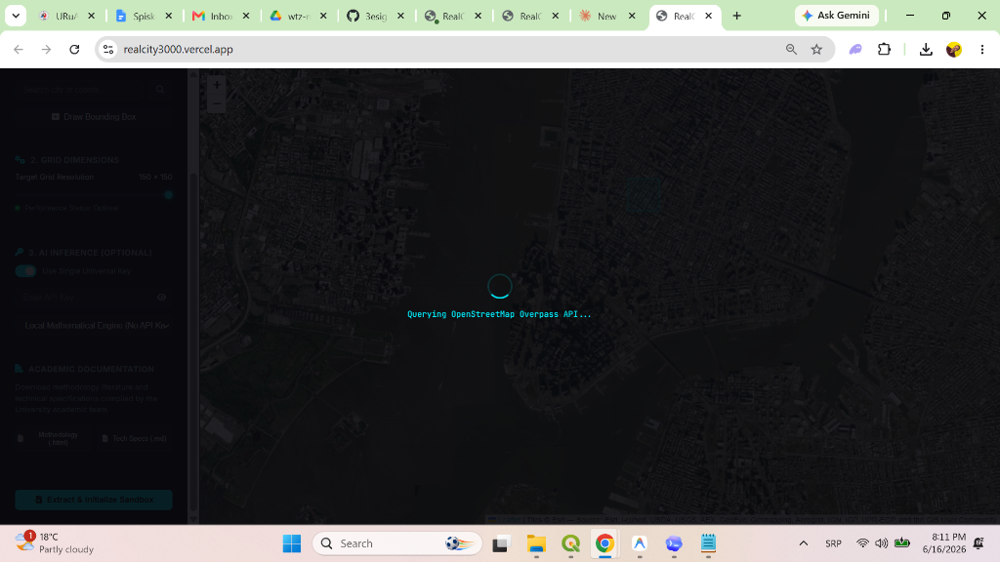
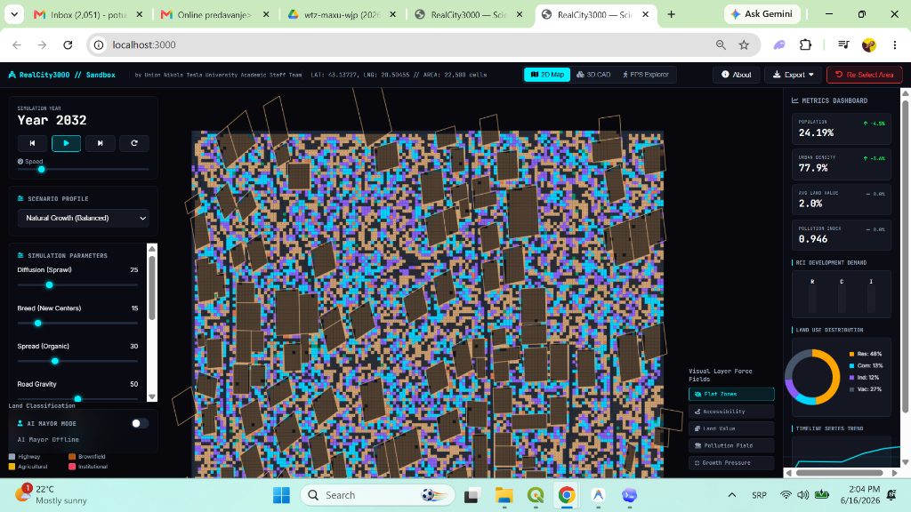
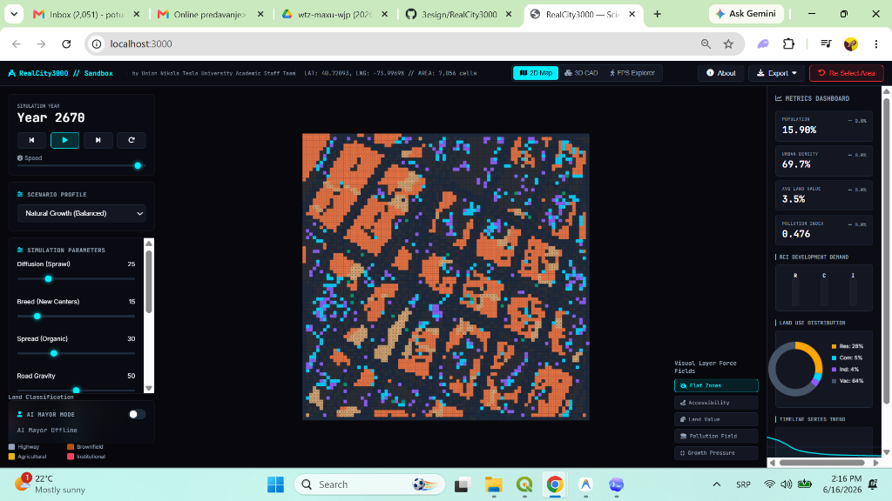

# RealCity3000: Interactive Urban Growth Digital Twin & Spatial Simulation Platform

### *Developed and Maintained by the Union Nikola Tesla University Academic Staff Team*

[](https://realcity3000.vercel.app)
[](LICENSE)

---

## 📖 The RealCity3000 Story: Bridging Map Data & Urban Science

Urban planning has always been a challenge of forecasting human behavior, economic waves, and physical constraints. When a new transit line is built or a zoning law is modified, how will the city respond over the next decade? 

**RealCity3000** is an interactive, scientific playground that turns geographic map data into a living digital twin. 

```
   [1] Map Selection  -->  [2] OSM Vector & Satellite Fusion  -->  [3] Living Digital Twin Grid
                                                                               |
   [6] WebGL 3D / 2D  <--  [5] SLEUTH Cellular Automata & ABM  <--  [4] Forrester System Dynamics
```

### How It Works: The Logic Behind the Model
1. **The Ground Truth (Digital Twin Construction)**: RealCity3000 starts by letting you draw a box anywhere on the globe. It fetches roads, water bodies, and building locations from OpenStreetMap (OSM). At the same time, it analyzes satellite imagery to identify natural forests, green parks, and industrial brownfields. It merges these two sources into a unified grid where each cell represents a 10m x 10m plot.
2. **Economic Engine (Forrester System Dynamics)**: The city's macro-economy is modeled as an interconnected feedback loop of residential housing, commercial shops, and industrial jobs. When jobs outnumber houses, housing demand rises, pushing population growth. If tax rates spike, demand collapses.
3. **Desirability Fields (Alonso Bid-Rent Theory)**: Land value isn't uniform. The value of a plot decays exponentially as you move away from commercial and business districts, creating realistic polycentric urban peaks.
4. **Growth & Sprawl (SLEUTH-inspired Cellular Automata)**: Spreading is modeled using Cellular Automata. New buildings appear randomly near roads (Road Gravity), expand organically from existing neighborhoods (Edge Growth), or seed new hubs (Spontaneous Growth).
5. **Developer Choices (Agent-Based Modeling)**: Autonomous developer agents inspect utility scores for every plot. A residential developer wants high access and proximity to green parks while avoiding industrial pollution.

---

## 🎨 Interactive Visual Showcase

### Real-Time 3D Rendering (WebGL)
Explore the simulation in real-time using a 3D isometric view. Observe high-rise developments grow and decline dynamically as economic demands shift.


### First-Person ground walk (FPS Explorer)
Switch to the **FPS ground mode** to walk through your simulated city, explore street canyons, and watch building facades morph in real time.


### 2D CAD Blueprint Interface
Switch to the 2D CAD layout view to examine land classifications, road corridors, and zoned building footprints with high-performance viewport culling.


---

## 🔬 Scientific Validation & Auto-Calibration (Simulated Annealing)

How do we know the simulation matches reality? RealCity3000 includes a built-in validation suite:

1. **Historical Validation Mode**: The engine clones your map, clears all development back to a **2017 baseline**, simulates forward to **2026**, and calculates spatial matching metrics (Precision, Recall, F1-Score, and Mean Spatial Error) compared to the actual 2026 OSM data.
2. **Machine-Learning Optimization**: Click **Calibrate** to run a **Simulated Annealing** optimization loop. The engine automatically perturbs sliders (Diffusion, Spread, Road Gravity) in real-time, testing combinations using Boltzmann cooling to find the parameters that maximize the F1-Score matching the real world.

---

## 📊 Comprehensive Forecasting & Report Downloads

RealCity3000 allows researchers and planners to export detailed analytical assets:
* **Academic Methodology Report (.html)**: Downloadable from the start screen, containing all citation papers, parameters, and structural equations.
* **Technical Specifications (.md)**: Technical document mapping the codebase flow and formulas.
* **Stochastic Monte Carlo Uncertainty Forecast (.txt)**: Available in-app once the simulation reaches the year 2032 projection threshold. It runs a 500-run sweep perturbing parameters to output 95% confidence intervals, OAT parameter sensitivity rankings, and anomaly diagnostics.

---

## 🛠️ Codebase Architecture & Technical Setup

RealCity3000 is built with zero heavy frameworks to ensure maximum performance, running 100% locally in the browser:
* **Three.js** with `THREE.InstancedMesh` for rendering thousands of buildings at 60 FPS.
* **Leaflet.js** for interactive geographic bounding box selection.
* **Vite** as a light and ultra-fast build tool.

### Local Installation
1. Clone the repository:
   ```bash
   git clone https://github.com/3esign/RealCity3000.git
   cd RealCity3000
   ```
2. Install dependencies:
   ```bash
   npm install
   ```
3. Run local dev server:
   ```bash
   npm run dev
   ```
4. Build production bundle:
   ```bash
   npm run build
   ```

### Vercel Cloud Deployment
Deploy to Vercel production using the Vercel CLI and Vercel authentication token:
```bash
vercel --token <YOUR_VERCEL_TOKEN> --prod --yes
```

---

## 👥 Authors & Signatures
**RealCity3000** is developed for research and policy analysis by:
**Union Nikola Tesla University Academic Staff Team**  
*Nikola Tesla University, Belgrade*
