# 🏙️ RealCity3000

### Interactive Urban Growth Digital Twin & Spatial Simulation Platform

> **From satellite imagery to simulated futures** — draw a bounding box anywhere on Earth, fuse real OpenStreetMap data with AI-classified satellite tiles, and watch a scientifically grounded urban simulation unfold across decades of simulated time.

[](https://realcity3000.vercel.app)
[](LICENSE)
[](#-technology-stack)

*Developed by PhD Poturak Semir & Union Nikola Tesla University Academic Staff Team, Belgrade*

---

## 📖 What Is RealCity3000?

Cities are complex adaptive systems. When a new transit corridor opens, a zoning policy changes, or industrial jobs leave, the ripple effects cascade through housing markets, traffic patterns, and land values over years and decades. Predicting these cascades is one of urban planning's hardest challenges.

**RealCity3000** is a browser-based digital twin platform that lets anyone — urban planners, researchers, students, or curious minds — simulate these dynamics using real geographic data:

1. 🗺️ **Select any area on Earth** using a satellite map
2. 🏗️ **Extract real buildings, roads, and water bodies** from OpenStreetMap
3. 🛰️ **Classify terrain** using AI satellite image analysis (forests, brownfields, vacant lots)
4. ⚙️ **Simulate decades of growth** using peer-reviewed urban science models
5. 📊 **Analyze results** with spatial metrics, Monte Carlo forecasts, and validation tools

> **The key insight**: RealCity3000 doesn't just simulate *a* city — it simulates *your chosen city* using its actual geography as the starting condition.

---

## 🔄 How It Works: The Pipeline

The simulation pipeline transforms raw geographic data into a living, evolving urban system:

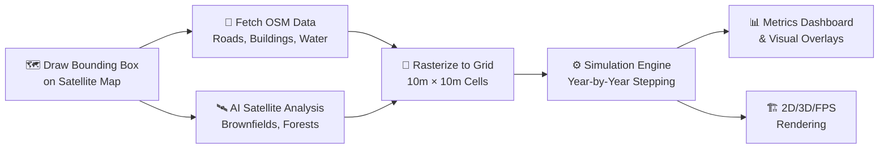

### Step 1: Geographic Data Acquisition

You draw a bounding box on the satellite map. RealCity3000 simultaneously:
- Queries **5 redundant Overpass API endpoints** for OpenStreetMap vector data (buildings, highways, waterways, land use polygons) with a local proxy fallback and mirror rotation.
- Fetches an **ESRI satellite tile** and sends it to an AI vision model for terrain classification (detecting forests, brownfields, vacant lots).
- Runs a **performance benchmark** to auto-calibrate grid resolution to your hardware.

### Step 2: Dual-Source Spatial Fusion

The raw data is fused into a unified land-use grid:
- **Bresenham's Line Algorithm** rasterizes road networks into cell connectivity paths.
- **Point-in-Polygon** tests project building footprints onto grid cells.
- **AI-classified overlays** seed forests, brownfields, and vacant lots from satellite imagery.
- Each cell stores 12+ attributes: type, density, elevation, road access, land value, pollution, population, etc.

### Step 3: Simulation Execution

Every "step" represents one simulated year. Four interconnected models run in sequence:

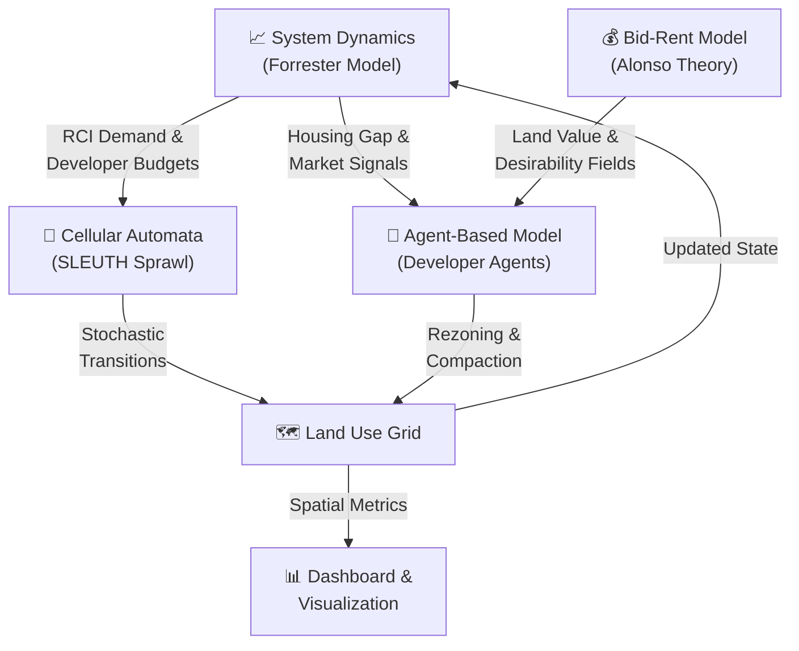

---

## 🤖 AI Mayor Governance Loop

To bridge the gap between simulation rules and dynamic policy-making, RealCity3000 includes an interactive **AI Mayor governance loop**. The AI Mayor reads the simulation's state and the user's high-level guidelines, proposing tax adjustments, land protection acts, and zoning caps.

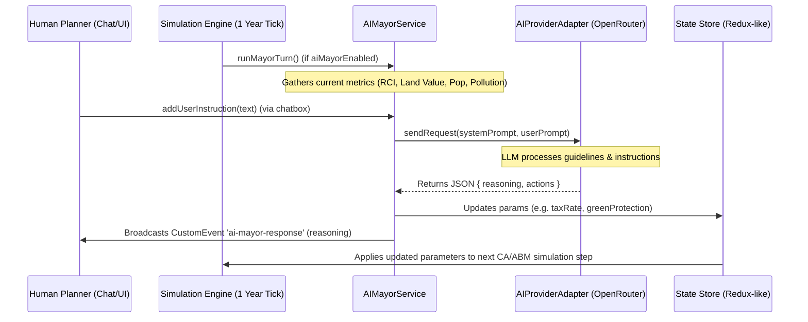

---

## 🎨 Visual Showcase

### 1. Map Selection & Bounding Box Extraction
Draw a bounding box anywhere on Earth. RealCity3000 queries Overpass API servers and pulls satellite imagery to build the baseline simulation grid.

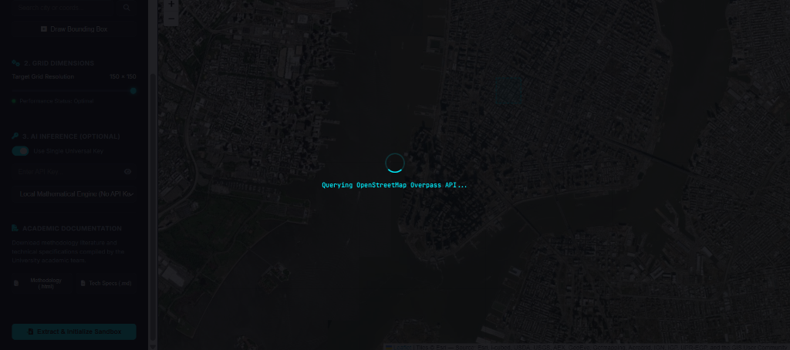

### 2. 2D Simulation Growth Progression
Observe the evolution of the city grid over time. The 2D grid updates live with land use classifications, developer activity, and simulation heatmaps.

| Early Growth (Procedural Start) | Mid-Growth Development | Mature High-Density City |
| :---: | :---: | :---: |
| 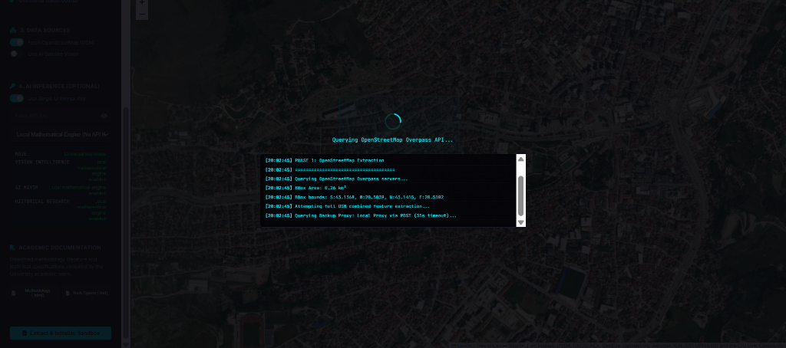 | 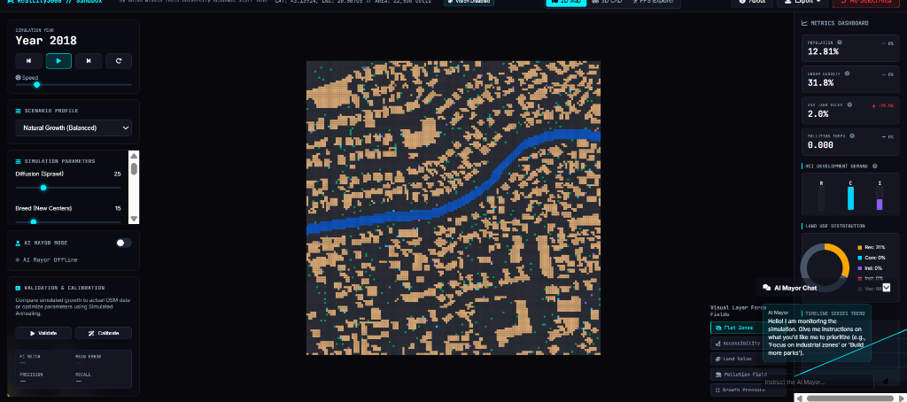 | 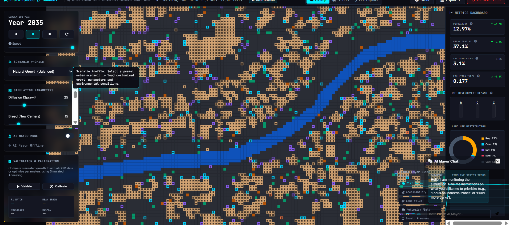 |

### 3. Simulation Metrics Dashboard
Analyze the city's health, demographics, and RCI (Residential, Commercial, Industrial) demand curves through a comprehensive real-time dashboard.

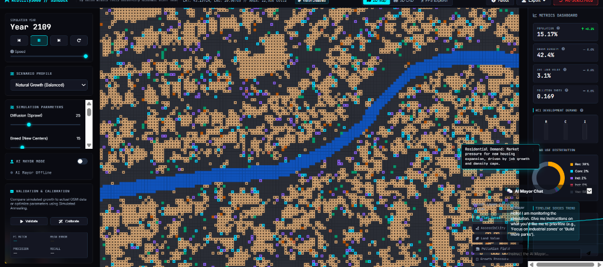

### 4. 3D WebGL Voxel Viewer
Transition to a fully interactive 3D WebGL mode powered by GPU-instanced meshes in Three.js, visualizing urban density peaks, buildings, and land value layers.

| 3D Simulation Overview | 3D Early Growth Peaks | 3D Mature Polycentric Peaks |
| :---: | :---: | :---: |
| 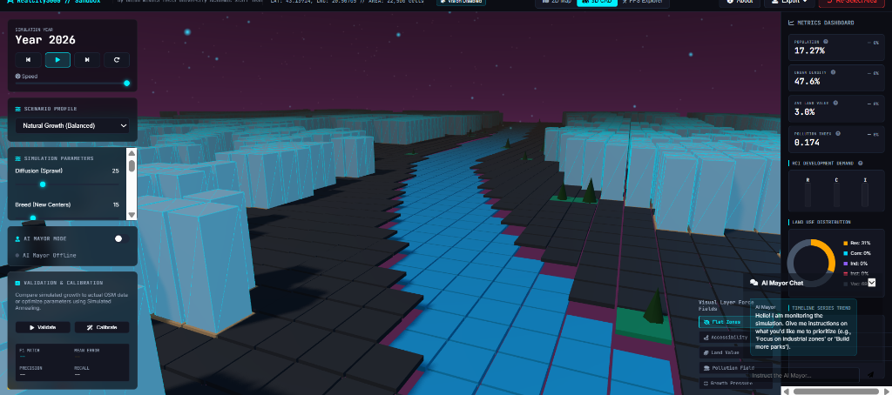 | 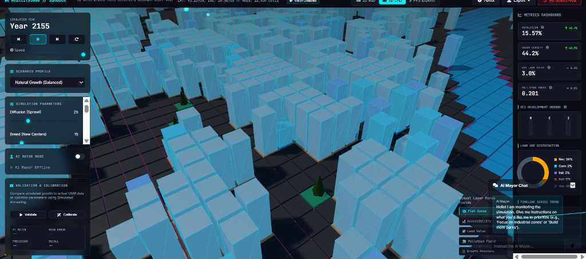 | 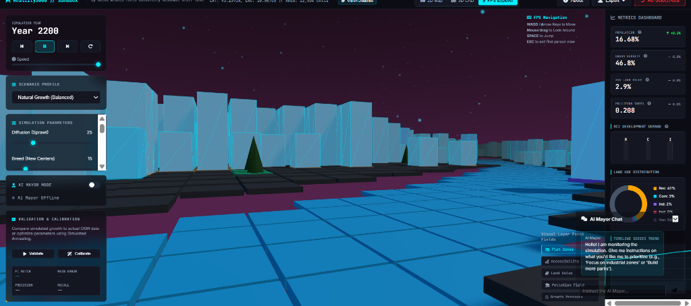 |

### 5. First-Person Street Explorer (FPS Mode)
Drop down to street level and explore the simulated city in first-person. Amber cells render as residential homes, cyan cells as skyscrapers, and purple cells as industrial complexes.

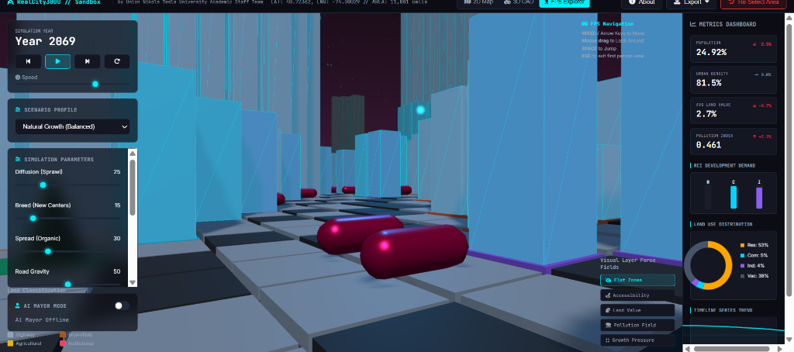

---

## 🧮 Mathematical Framework & Parameters

### A. Forrester System Dynamics (Macro-Economic Engine)
The city's economy is modeled as a stock-and-flow feedback system. Residential ($R$), Commercial ($C$), and Industrial ($I$) stocks interact through coupled differential demand equations:

$$F_{demand}(t) = \text{clamp}\left(\frac{R_{demand} + C_{demand} + I_{demand}}{3}, 0.1, 2.0\right)$$

$$R_{demand} = \text{BaseDemand} \times \left(1 + \frac{\text{HousingGap}}{1000}\right) \times (1 - 0.005 \times \text{TaxRate})$$

### B. Alonso Bid-Rent Model (Land Value Fields)
Land values decay exponentially with distance to commercial centers, modified by road accessibility, proximity to green space, and industrial pollution:

$$V(x,y) = V_{\text{base}} \times \text{Access}^{0.6} \times \text{GreenProx}^{0.3} \times (1 - \text{Pollution}^{0.6}) \times e^{-\lambda \cdot d_{com}}$$

### C. SLEUTH Cellular Automata (Sprawl Mechanics)
Land transitions use four Monte Carlo CA rules inspired by the SLEUTH model:

| Parameter | Mathematical Formulation | Preset Settings | Description |
| :--- | :--- | :--- | :--- |
| **Diffusion** | $P = \frac{\text{Diffusion}}{2500} \times (1 - \frac{\text{Slope}}{10}) \times (1 - D_{urban}) \times F_{demand}$ | Natural: `25`<br/>Boom: `50`<br/>Eco: `10`<br/>Sprawl: `75` | Probability of spontaneous nucleation of new urban cells. |
| **Breed** | $P = \frac{\text{Breed}}{150} \times (1 - D_{urban}) \times F_{demand}$ | Natural: `15`<br/>Boom: `40`<br/>Eco: `5`<br/>Sprawl: `20` | Probability of a new spontaneous cluster developing into a permanent growth center. |
| **Spread** | $P = \frac{\text{Spread}}{200} \times N_{urban} \times (1 - D_{urban}) \times F_{demand}$ | Natural: `30`<br/>Boom: `60`<br/>Eco: `20`<br/>Sprawl: `15` | Edge growth probability representing organic expansion around existing urban boundaries. |
| **Road Gravity** | $P = \frac{\text{RoadGrav}}{200} \times e^{-d_{road}/10} \times (1 - D_{urban}) \times F_{demand}$ | Natural: `50`<br/>Boom: `70`<br/>Eco: `30`<br/>Sprawl: `80` | Probability of urban development being attracted to transport corridors. |

### D. Agent-Based Developer Model (Micro-Economic Decisions)
Autonomous developer agents scan the grid and build on cells that maximize their discrete utility functions:

$$\text{Residential: } U_R = 0.4 \cdot \text{Access} + 0.3 \cdot \text{Green} - 0.2 \cdot \text{Pollution} - 0.1 \cdot V_{land}$$
$$\text{Commercial: } U_C = 0.4 \cdot \text{LocalPop} + 0.4 \cdot \text{Access} + 0.2 \cdot V_{land}$$
$$\text{Industrial: } U_I = 0.5 \cdot (1 - V_{land}) + 0.4 \cdot \text{Access} - 0.3 \cdot \text{LocalPop}$$

### E. Policy & Governance Parameters

| Parameter | Type / Range | Preset Settings | Description |
| :--- | :--- | :--- | :--- |
| **Green Protection** | Percentage `[0, 100]` | Natural: `40`<br/>Boom: `10`<br/>Eco: `90`<br/>Sprawl: `15` | Strength of zoning bans on forest, park, and water cells. |
| **Tax Rate** | Percentage `[0, 30]` | Natural: `15`<br/>Boom: `5`<br/>Eco: `20`<br/>Sprawl: `8` | Dynamic tax rates; higher taxes suppress macro demand stocks. |
| **Environmental Reg** | Percentage `[0, 100]` | Natural: `30`<br/>Boom: `10`<br/>Eco: `85`<br/>Sprawl: `20` | Controls pollution penalties and suppresses industrial development. |
| **Density Cap** | Height Units `[1, 20]` | Natural: `10`<br/>Boom: `18`<br/>Eco: `8`<br/>Sprawl: `4` | Maximum building height/density developer agents can construct. |
| **Transit Investment** | Percentage `[0, 100]` | Natural: `20`<br/>Boom: `10`<br/>Eco: `85`<br/>Sprawl: `5` | Funding for public transit, increasing access scores of peripheral cells. |

---

## 🔬 Validation & Calibration

RealCity3000 includes a built-in scientific validation pipeline:

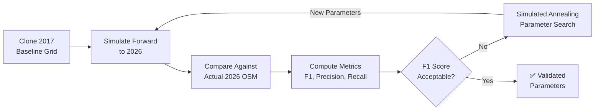

### Spatial Science Metrics

| Metric | Formula | Interpretation |
| :--- | :--- | :--- |
| **Shannon Entropy** | $H = -\frac{\sum_{k=1}^{64} p_k \ln(p_k)}{\ln(64)}$ | Low = compact, dense city; High = dispersed leapfrog sprawl. |
| **Moran's I** | $I = \frac{N}{S_0} \frac{\sum_i \sum_j w_{ij}(x_i - \bar{x})(x_j - \bar{x})}{\sum_i (x_i - \bar{x})^2}$ | Spatial autocorrelation of land values; measures clustering of wealth. |
| **Growth Dispersion** | $GDI = \frac{\text{Spontaneous cells}}{\text{Edge growth cells}}$ | Ratio of random spontaneous development versus organic edge sprawl. |

---

## 🛠️ Technology Stack

RealCity3000 runs 100% client-side with zero server-side database requirements:

| Component | Technology | Purpose |
| :--- | :--- | :--- |
| **3D Rendering** | Three.js (`InstancedMesh`) | 60 FPS GPU-instanced building rendering. |
| **Map Selection** | Leaflet.js | Bounding box drawing on ESRI Satellite tiles. |
| **Build Tool** | Vite | Ultra-fast development server & optimized builds. |
| **AI Inference** | OpenRouter / OpenAI API | Satellite terrain classification & AI Mayor policy advisor. |
| **Geographic Data** | Overpass API | Extraction of buildings, roads, and waterways. |
| **Hosting** | Vercel | Production edge deployments. |

---

## 🚀 Getting Started

### Installation
```bash
git clone https://github.com/3esign/RealCity3000.git
cd RealCity3000
npm install
```

### Development
```bash
npm run dev
```

### Optional: AI Features
To enable AI Mayor advice and satellite classification:
1. Obtain an API key from **OpenRouter** or **OpenAI**.
2. Enter the key in the "AI Inference" panel on the start screen.
3. *Note: If no key is provided, the platform automatically falls back to procedural terrain classification and mock advisor loops.*

---

## 👥 Authors

**PhD Poturak Semir** - Creator & Leader of the Development Team  
**Union Nikola Tesla University Academic Staff Team**  
*Nikola Tesla University, Belgrade*

**Contact:** [poturaksemir@gmail.com](mailto:poturaksemir@gmail.com)

---
<p align="center">
  <sub>Built with ☕ and urban science. MIT License.</sub>
</p>
