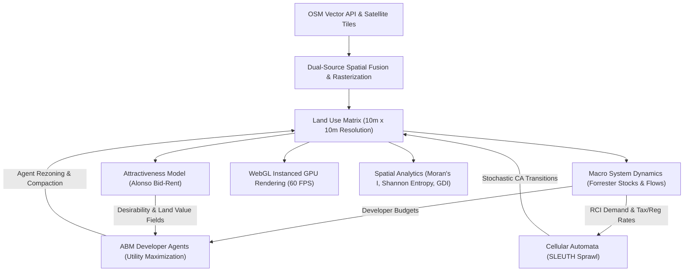

# RealCity3000: Interactive Urban Growth Digital Twin & Spatial Simulation Platform

### *Developed and Maintained by the Union Nikola Tesla University Academic Staff Team*

[](https://realcity3000.vercel.app)
[](LICENSE)

---

## 📖 The RealCity3000 Story: Bridging Map Data & Urban Science

Urban planning has always been a challenge of forecasting human behavior, economic waves, and physical constraints. When a new transit line is built or a zoning law is modified, how will the city respond over the next decade? 

**RealCity3000** is an interactive, scientific playground that turns geographic map data into a living digital twin. 

```
   [1] Map Bounding Box  -->  [2] OSM Vector & Satellite Fusion  -->  [3] Living Digital Twin Grid
                                                                                   |
   [6] WebGL 3D / 2D  <--  [5] SLEUTH Cellular Automata & ABM  <--  [4] Forrester System Dynamics
```

### How It Works: The Logic Behind the Model
1. **The Ground Truth (Digital Twin Construction)**: RealCity3000 starts by letting you draw a box anywhere on the globe. It fetches roads, water bodies, and building locations from OpenStreetMap (OSM). At the same time, it analyzes satellite imagery to identify natural forests, green parks, and industrial brownfields. It merges these two sources into a unified grid where each cell represents a 10m x 10m plot.
2. **Economic Engine (Forrester System Dynamics)**: The city's macro-economy is modeled as an interconnected feedback loop of residential housing, commercial shops, and industrial jobs. When jobs outnumber houses, housing demand rises, pushing population growth. If tax rates spike, demand collapses.
3. **Desirability Fields (Alonso Bid-Rent Theory)**: Land value isn't uniform. The value of a plot decays exponentially as you move away from commercial and business districts, creating realistic polycentric urban peaks.
4. **Growth & Sprawl (SLEUTH-inspired Cellular Automata)**: Spreading is modeled using Cellular Automata. New buildings appear randomly near roads (Road Gravity), expand organically from existing neighborhoods (Edge Growth), or seed new hubs (Spontaneous Growth).
5. **Developer Choices (Agent-Based Modeling)**: Autonomous developer agents inspect utility scores for every plot. A residential developer wants high access and proximity to green parks while avoiding industrial pollution.

---

## 🎨 Interactive Visual Showcase

### Real-Time 3D Rendering (WebGL)
Explore the simulation in real-time using a 3D isometric view. Observe high-rise developments grow and decline dynamically as economic demands shift.


### First-Person ground walk (FPS Explorer)
Switch to the **FPS ground mode** to walk through your simulated city, explore street canyons, and watch building facades morph in real time.


### 2D CAD Blueprint Interface
Switch to the 2D CAD layout view to examine land classifications, road corridors, and zoned building footprints with high-performance viewport culling.


---

## 🔬 Scientific Validation & Auto-Calibration (Simulated Annealing)

How do we know the simulation matches reality? RealCity3000 includes a built-in validation suite:

1. **Historical Validation Mode**: The engine clones your map, clears all development back to a **2017 baseline**, simulates forward to **2026**, and calculates spatial matching metrics (Precision, Recall, F1-Score, and Mean Spatial Error) compared to the actual 2026 OSM data.
2. **Machine-Learning Optimization**: Click **Calibrate** to run a **Simulated Annealing** optimization loop. The engine automatically perturbs sliders (Diffusion, Spread, Road Gravity) in real-time, testing combinations using Boltzmann cooling to find the parameters that maximize the F1-Score matching the real world.

---

## 📐 Theoretical Architecture & Mathematical Framework



### A. SLEUTH Sprawl Transition Equations
Every tick (simulated year), the grid runs four Monte Carlo cellular automata sweeps. All transition probabilities are constrained by the local carrying capacity $(1 - D_{urban})$ and RCI demand factor $F_{demand}$:

* **Spontaneous Sprawl**: Random nucleation of undeveloped land:
  \[P_{spontaneous} = \frac{\text{Diffusion}}{2500} \times \left( 1 - \frac{\text{Slope}}{10} \right) \times (1 - D_{urban}) \times F_{demand} \times \text{CompactionModifier}\]

* **New Spreading Centers**: Probability that a newly generated spontaneous cell becomes a permanent breeding nucleus:
  \[P_{breed} = \frac{\text{Breed}}{150} \times (1 - D_{urban}) \times F_{demand}\]

* **Organic Edge Growth**: Agglomeration spreading outward from existing urban edges:
  \[P_{edge} = \frac{\text{Spread}}{200} \times N_{urban} \times (1 - D_{urban}) \times F_{demand}\]
  *Where $N_{urban}$ represents the count of developed Moore neighbors ($0 \le N_{urban} \le 8$).*

* **Road-Influenced Gravity**: Development attracted to transit highway corridors:
  \[P_{road} = \frac{\text{RoadGravity}}{200} \times e^{-d_{road} / 10} \times (1 - D_{urban}) \times F_{demand}\]
  *Where $d_{road}$ is the Euclidean cell distance to the nearest highway.*

---

### B. Alonso Bid-Rent rent-gradient Model
Land values decay exponentially relative to accessibility to commerce and highway networks:

\[V(x,y) = V_{\text{base}} \times \text{Accessibility}^{0.6} \times \text{GreenAccess}^{0.3} \times (1 - \text{Pollution}^{0.6}) \times e^{-\lambda d_{com}}\]

Where:
- $\text{Accessibility}$ represents connectivity to local roads.
- $\text{GreenAccess}$ is the proximity score to forests/parks.
- $\text{Pollution}$ is modeled as inverse-square smoke dispersal from active industrial zones.
- $\lambda = 0.015$ is the spatial land value rent decay constant.
- $d_{com}$ is the Euclidean distance to the nearest Commercial cell.

---

### C. Agent-Based Utility Maximization Curves
Autonomous developer agents scan the grid and place new zones on coordinates that maximize their discrete utility:

| Developer Class | Target Zone | Utility Function ($U$) |
| :--- | :--- | :--- |
| **Residential** | Residential (Low/High) | \(U_R = 0.4 \cdot \text{Access} + 0.3 \cdot \text{Green} - 0.2 \cdot \text{Pollution} - 0.1 \cdot V_{\text{land}}\) |
| **Commercial** | Commercial | \(U_C = 0.4 \cdot \text{LocalPop} + 0.4 \cdot \text{Access} + 0.2 \cdot V_{\text{land}}\) |
| **Industrial** | Industrial | \(U_I = 0.5 \cdot (1 - V_{\text{land}}) + 0.4 \cdot \text{Access} - 0.3 \cdot \text{LocalPop}\) |

---

### D. Parameter Calibration via Simulated Annealing
To align the simulation with actual urban history, the auto-calibration loop uses a Simulated Annealing heuristic. It seeks to optimize parameter vectors $\theta = \langle \text{Diffusion}, \text{Spread}, \text{RoadGravity} \rangle$ to maximize the validation F1-Score:

1. **Cost Function**: $C(\theta) = 1.0 - \text{F1}(\theta)$
2. **Cooling Schedule**: The temperature decreases at iteration step $k$:
   \[T_k = T_0 \times \alpha^k \quad (\text{with } T_0 = 0.5, \ \alpha = 0.85)\]
3. **Acceptance Probability**: A candidate set of parameters $\theta'$ is accepted according to the Metropolis-Hastings criterion:
   \[P(\text{Accept}) = \begin{cases} 
      1 & \text{if } C(\theta') < C(\theta) \\
      e^{-\frac{C(\theta') - C(\theta)}{T_k}} & \text{if } C(\theta') \ge C(\theta)
   \end{cases}\]

---

### E. Spatial Science Analytics
RealCity3000 computes three main spatial metrics dynamically over the land-use matrix:

* **Shannon Sprawl Entropy**: Measures sprawl dispersion over an $8 \times 8$ partitioned spatial grid. Lower values represent compact, nucleated cities; higher values indicate dispersed, uniform sprawl:
  \[H = -\frac{\sum_{k=1}^{64} p_k \ln(p_k)}{\ln(64)}\]
  *Where $p_k$ is the proportion of urbanized cells in zone $k$.*

* **Sparse Moran's I**: Computes spatial autocorrelation of land values over adjacent Moore neighbors:
  \[I = \frac{N}{S_0} \frac{\sum_{i} \sum_{j} w_{ij} (x_i - \bar{x})(x_j - \bar{x})}{\sum_{i} (x_i - \bar{x})^2}\]
  *Where $x_i$ is the land value of cell $i$, $w_{ij}$ is the adjacency matrix weight (1 if $j$ is a Moore neighbor of $i$, 0 otherwise), and $S_0$ is the sum of all weights.*

* **Growth Dispersion Index (GDI)**: Classified dynamically by comparing spontaneous growth pixels against organic edge pixels:
  \[GDI = \frac{\text{Total Spontaneous CA cells}}{\text{Total Organic Edge CA cells}}\]

---

## 🛠️ Codebase Architecture & Technical Setup

RealCity3000 is built with zero heavy frameworks to ensure maximum performance, running 100% locally in the browser:
* **Three.js** with `THREE.InstancedMesh` for rendering thousands of buildings at 60 FPS.
* **Leaflet.js** for interactive geographic bounding box selection.
* **Vite** as a light and ultra-fast build tool.

### Local Installation
1. Clone the repository:
   ```bash
   git clone https://github.com/3esign/RealCity3000.git
   cd RealCity3000
   ```
2. Install dependencies:
   ```bash
   npm install
   ```
3. Run local dev server:
   ```bash
   npm run dev
   ```
4. Build production bundle:
   ```bash
   npm run build
   ```

### Vercel Cloud Deployment
Deploy to Vercel production using the Vercel CLI and Vercel authentication token:
```bash
vercel --token <YOUR_VERCEL_TOKEN> --prod --yes
```

---

## 👥 Authors & Signatures
**RealCity3000** is developed for research and policy analysis by:
**Union Nikola Tesla University Academic Staff Team**  
*Nikola Tesla University, Belgrade*
