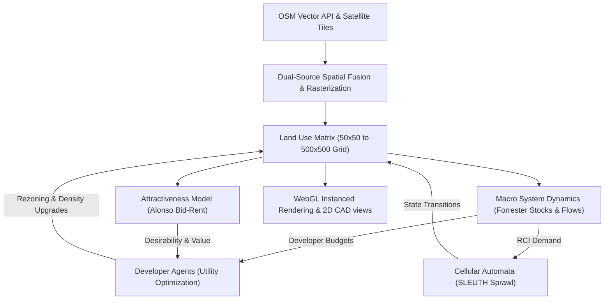

# RealCity3000: A Multi-Paradigm GIS-Integrated Computational Framework for Urban Growth Dynamics and Policy Evaluation

### *Developed and Maintained by the Union Nikola Tesla University Academic Staff Team*

---

## Abstract
**RealCity3000** is an open-source, high-performance urban simulation platform designed to model, analyze, and project the spatio-temporal evolution of real-world metropolitan areas. By integrating **deterministic cadastral vectors** from OpenStreetMap (OSM) with **spectral satellite tile classifications**, the framework constructs a unified land-use matrix. Urban dynamics are simulated using a nested, multi-scale architecture: macro-level demand is governed by **Forrester stock-and-flow System Dynamics**, land value desirability is distributed using **Alonso's Bid-Rent gradients**, and micro-spatial development is executed via **Monte Carlo Cellular Automata (CA)** growth rules combined with **Agent-Based Model (ABM)** developer utility optimization. 

The framework is built using Vanilla JS and WebGL (Three.js), running 100% locally in the client browser with GPU-instanced rendering to execute large-scale grids at 60 FPS.

---

## 1. Theoretical Architecture & Computational Models



### A. Dual-Source Spatial Data Fusion
The framework extracts and compiles urban layouts using two complementary sources of spatial information:
1. **Deterministic Cadastral Outlines (Source 1 - Vector)**: Fetched directly from the OSM Overpass API, providing absolute geometric outlines of highways, building footprints, and water bodies.
2. **Spectral Optical Anomalies (Source 2 - Raster)**: Extracted from ESRI World Imagery satellite tiles. Visual pixel distributions are parsed to classify natural structures (e.g., forest canopies), vacant lots, and rust-belt brownfields.

**Positional Synthesis**: The vector footprints act as structural boundaries. The satellite raster stream identifies environmental attributes within unmapped cadastral voids, resulting in a cohesive LULC (Land Use / Land Cover) coordinate grid.

### B. SLEUTH-Derived Cellular Automata Sprawl Model
Urban spatial expansion is computed through four Monte Carlo transition loops executing every simulated step (year). To achieve realistic long-term stabilization, CA probabilities are governed by a global **Carrying Capacity** factor \\((1 - D_{urban})\\) and the macro **RCI Demand Factor** \\(F_{demand}\\):

* **Spontaneous Growth**: Models random urbanization of vacant land. Probability:
  $$P_{spontaneous} = \frac{\text{Diffusion}}{2500} \times \left( 1 - \frac{\text{Slope}}{10} \right) \times (1 - D_{urban}) \times F_{demand} \times \text{DensityModifier}$$

* **New Spreading Centers (Breed)**: Determines whether a newly urbanized cell will spawn an independent spreading nucleus:
  $$P_{breed} = \frac{\text{Breed}}{150} \times (1 - D_{urban}) \times F_{demand}$$

* **Edge (Organic) Growth**: Simulates organic urban expansion radiating outwards from existing boundaries:
  $$P_{edge} = \frac{\text{Spread}}{200} \times N_{urban} \times (1 - D_{urban}) \times F_{demand}$$
  *Where \\(N_{urban}\\) is the count of developed neighbors (Moore neighborhood).*

* **Road-Influenced Growth**: Models the attractive force of transit corridors (highways), drawing new developments to roadside areas:
  $$P_{road} = \frac{\text{RoadGravity}}{200} \times e^{-d_{road} / 10} \times (1 - D_{urban}) \times F_{demand}$$
  *Where \\(d_{road}\\) is the Euclidean distance to the nearest road cell.*

*Note: The \\(\text{DensityModifier}\\) acts as local compaction resistance. When local density in a 5x5 window exceeds 60%, growth chances scale down (to a minimum of 0.05); low local density scales growth up (to 2.5x) to model aggressive edge expansion.*

---

### C. Carrying Capacity & Baseline Dynamics
To prevent the infinite expansion of developed spaces, the Pearl-Verhulst logistic growth equation is implemented:

$$F_{capacity} = 1 - D_{urban}$$

Where \\(D_{urban} = \frac{\text{Total Developed Cells}}{\text{Total Grid Cells}}\\). Additionally, to prevent complete stagnation and freeze frames when macro demand reaches zero, we establish a baseline activity floor:

$$F_{demand} = \max\left(0.15, \frac{\text{Demand}_R + \text{Demand}_C + \text{Demand}_I}{300.0}\right)$$

This minimum floor of `0.15` ensures that decay, demolition, and baseline urban renewal continue to tick dynamically over centuries (e.g. Year 2600+), allowing buildings to disappear and reappear in real time.

---

### D. Alonso Bid-Rent Theory & Desirability Fields
Location value (desirability) of each coordinate is modeled according to Alonso's Bid-Rent theory, stipulating that land desirability decays exponentially away from commercial and transit nodes:

$$V(x,y) = V_{\text{base}} \times \text{Accessibility}^{0.6} \times \text{GreenAccess}^{0.3} \times (1 - \text{Pollution}^{0.6}) \times e^{-\lambda d}$$

Where:
- \\(\text{Accessibility}\\) represents access to local transit networks.
- \\(\text{GreenAccess}\\) is the access to forest/park spaces.
- \\(\text{Pollution}\\) is modeled as inverse-square falloff radiating from industrial centers.
- \\(\lambda = 0.04\\) is the spatial land value rent decay constant.
- \\(d\\) is the distance from the commercial center centroid.

---

### E. Agent-Based Utility Optimization (ABM Layer)
In parallel with CA transitions, autonomous developer agents make micro-spatial decisions to place or rezone developments by maximizing discrete utility curves:

| Agent Class | Zoning Target | Utility Maximization Formula |
| :--- | :--- | :--- |
| **Residential Developer** | Residential (Low/High) | $$U_R = (0.4 \cdot \text{Access} + 0.3 \cdot \text{Green} - 0.2 \cdot \text{Pollution} - 0.1 \cdot V_{\text{land}}) \times \text{DensityModifier}$$ |
| **Commercial Developer** | Commercial | $$U_C = 0.4 \cdot \text{LocalPop} + 0.4 \cdot \text{Access} + 0.2 \cdot V_{\text{land}}$$ |
| **Industrial Developer** | Industrial | $$U_I = 0.5 \cdot (1 - V_{\text{land}}) + 0.4 \cdot \text{Access} - 0.3 \cdot \text{LocalPop}$$ |

- **OSM Building Integration**: Existing OSM buildings are represented as grid developed cells. Under decay or low demand, they lose density. When density reaches 0, the building "disappears" (reverting to vacant or brownfield and clearing the cadastral metadata). Conversely, under high demand, developer agents can redevelop or rezone them.
- **Budget Limits**: Active developer budgets are capped by \\(F_{capacity}\\):
  - Residential budget: \\(\text{Budget}_R = \text{floor}\left(\frac{\text{Demand}_R}{40} \times F_{capacity}\right)\\)
  - Commercial budget: \\(\text{Budget}_C = \text{floor}\left(\frac{\text{Demand}_C}{50} \times F_{capacity}\right)\\)
  - Industrial budget: \\(\text{Budget}_I = \text{floor}\left(\frac{\text{Demand}_I}{50} \times F_{capacity}\right)\\)
  - *A baseline fallback (12-15% chance of 1 build) is added when demand is negative to model private maintenance/reconstruction.*

---

### F. Forrester Stock-and-Flow System Dynamics
The macro-economy represents an interconnected stock-and-flow feedback loop balancing labor pools, housing capacities, and capital:

$$\text{Jobs} = (5 \times \text{Commercial}) + (8 \times \text{Industrial}) + (4 \times \text{Institutional})$$

$$\text{HousingGap} = \text{Jobs} - \text{Population}$$

Macro demand rates are updated dynamically:

$$\Delta_R = \text{HousingGap} \times 0.05 - (\text{TaxRate} - 15) \times 0.8 + \text{PopGrowth} \times 1.5 + C_R - P_{congestion} - P_{tax}$$

$$\text{Demand}_R = \text{clamp}(\text{Demand}_R + \Delta_R, 0, 100)$$

Where:
- **Macroeconomic Cycles**: Sine/cosine waves are injected to represent cyclical trends:
  - \\(C_R = 6.0 \times \sin(\text{Year} \times 0.15)\\)
  - \\(C_C = 5.0 \times \sin(\text{Year} \times 0.10)\\)
  - \\(C_I = 5.0 \times \cos(\text{Year} \times 0.08)\\)
- **Congestion Penalty**: \\(P_{congestion} = 6.0 \times D_{urban}\\) (demands drop as grid becomes dense).
- **High Tax Penalty**: \\(P_{tax} = (\text{TaxRate} - 20) \times 1.5\\) (penalizes growth if taxes exceed 20%).
- **Environmental Regulations Penalty**: Deducts Industrial demand if regulations exceed 40%.

---

## 2. Technical Stack & Architecture

- **Build Tooling & Server**: Vite 5.2.0, hot-reloading ES modules.
- **2D Visualizer (Canvas 2D)**: Custom rendering path implementing coordinate transformations, viewport culling, and grid-aligned developed cell outlines.
- **3D Render Engine (Three.js)**: GPU-instanced mesh rendering using `THREE.InstancedMesh`. Building geometry uses lightweight solid cubes and wireframe overlays, yielding steady 60 FPS rates for grids of up to $500 \times 500$ cells.
- **First Person ground view (FPS Explorer)**: WASD + mouse-look walking camera. Features bilinear terrain height checks for smooth vertical walking and AABB circle bounding collision checks against solid buildings.
- **State Store**: Centralized unidirectional application state container.

---

## 3. Code Reference Tree

- `src/main.js`: Root application coordinator. Orchestrates visualizers, starts timeline clock, and handles dual-source vector + vision merges.
- `src/state/store.js`: Global state container (parameters, cells matrix, KPIs).
- `src/simulation/SimulationEngine.js`: Primary loop manager executing updates in sequence (Scenarios -> Attractiveness -> ABM -> CA -> System Dynamics).
- `src/simulation/CellularAutomata.js`: Spontaneous, organic, and road-influenced SLEUTH sprawl rules.
- `src/simulation/DevelopmentAgents.js`: Developer agent placement logic and carrying capacity calculations.
- `src/simulation/SystemsDynamics.js`: Forrester stock-flow demand and economic cycle deltas.
- `src/viz/ThreeJSRenderer.js`: WebGL 3D visualization, instanced meshes, ground FPS walking camera, and parameters mapping.
- `src/viz/Canvas2DRenderer.js`: Viewport culled 2D CAD blueprint graphics.
- `src/export/ExportService.js`: JSON/CSV database down loaders and mathematical text report writers.

---

## 4. Setup, Deployment & Local Run

### Local Installation
1. Clone the repository:
   ```bash
   git clone https://github.com/3esign/RealCity3000.git
   cd RealCity3000
   ```
2. Install dependencies:
   ```bash
   npm install
   ```
3. Run the development server locally:
   ```bash
   npm run dev
   ```
4. Access the application in your browser at `http://localhost:3000`.

### Vercel Deployment
To deploy the application to Vercel, ensure you have the Vercel CLI installed:
```bash
npm install -g vercel
```
Then deploy using your Vercel authentication token:
```bash
vercel --token <YOUR_VERCEL_TOKEN> --prod --yes
```

---

## License & Signatures
**RealCity3000** is licensed under the MIT Open Source License.

*Signatories:*
**Union Nikola Tesla University Academic Staff Team**
*Nikola Tesla University, Belgrade*
